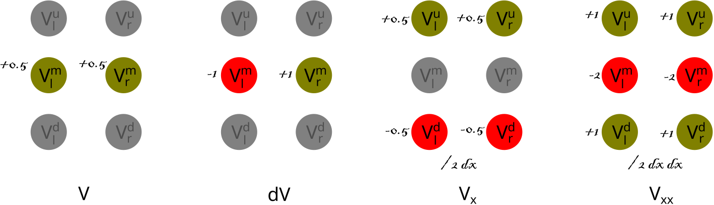

# Crank-Nicolson method.

The Crank Nicolson (CN) method discretizes the derivatives of price using six grid points.

Let $V^u_l$, $V^m_l$, $V^d_l$ be the upper, middle and lower gridpoints on the left hand side (prices after the timestep), and $V^u_r$, $V^m_r$, $V^d_r$ be the corresponding gridpoints on the right hand side (prices before the timestep). 

$$
\begin{matrix}
V^u_l & V^u_r \\
V^m_l & V^m_r \\
V^d_l & V^d_r
\end{matrix}
$$

We can substitute $V$, $dV$, $V_x$, and $V_{xx}$ in the above PDE, by the discrete estimates based on the Crank-Nicolson method.

See `discretize_crank_nicolson` in `utils/symfns.py` for the implementation of this discretization. Each notebook uses this utility to determine the CN coefficients in each timestep from the model parameters.